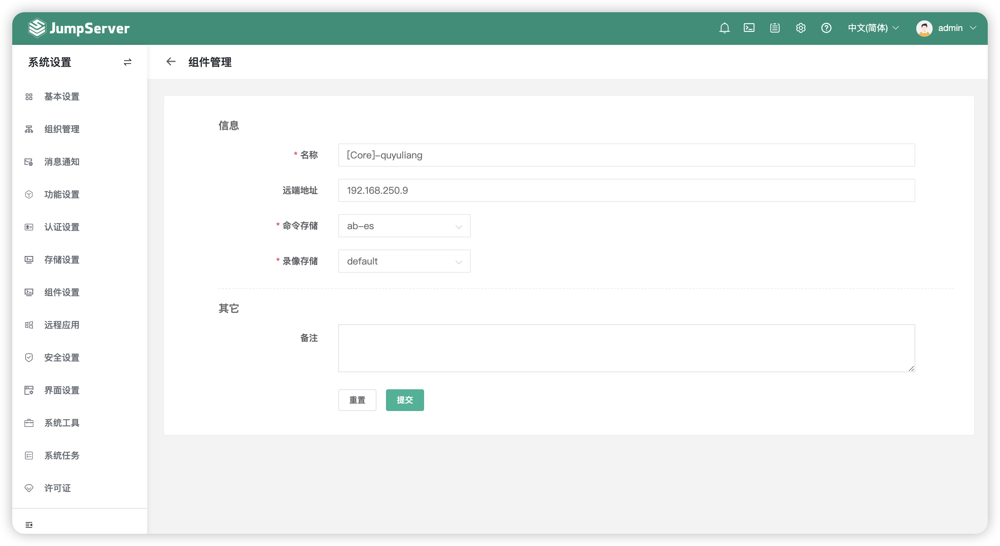
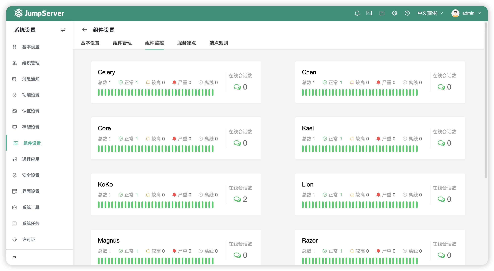
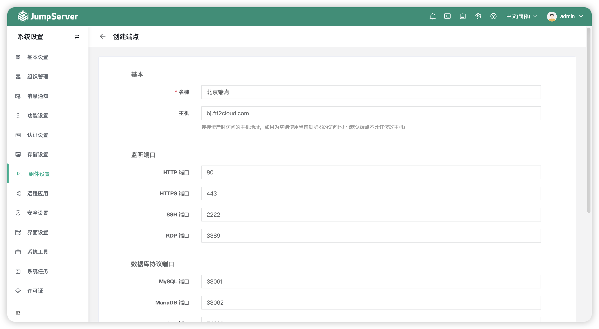
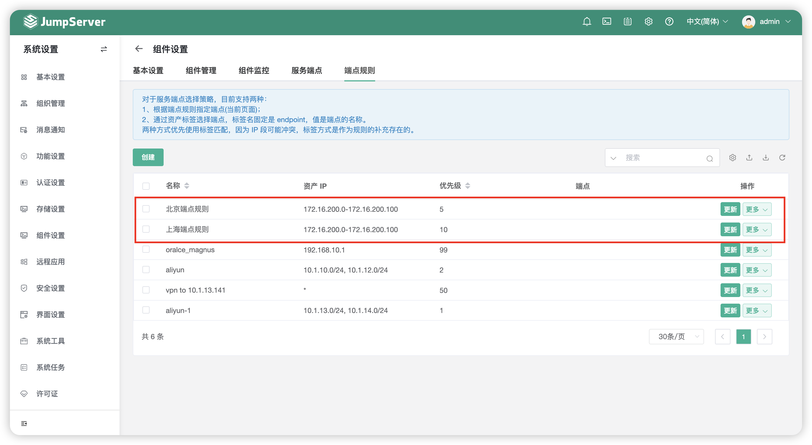

# 组件设置
## 1 功能简述
!!! tip ""
    - 点击页面左侧菜单的`组件设置`按钮，进入组件设置页面。
    - 组件设置页面，可以配置 JumpServer 终端组件相关功能，例如 SSH Client 等连接方式开启、命令存储、录像存储等相关配置。

## 2 基本设置
!!! tip ""
    - 基本设置主要对三个方面进行设置：KoKo 组件、Razor 组件和 Magnus 组件。

!!! tip ""
    - KoKo 组件是服务于类 Unix 资产平台的组件，该组件的功能主要是：命令行的方式纳管 Linux、数据库、K8S 等资产；
    - 作为 SSH 服务，还可通过2222端口进行 SSH 或者 SFTP 操作资产。

!!! tip ""
    - Razor 组件是服务于 Windows 系统的组件，主要通过 JumpServer Client 连接 Windows 资产。
    - Magnus 组件是服务于数据库资产的组件，主要功能是以数据库代理的方式支持用户通过原生数据库客户端（例如 Navicat、SQLyog 等）对数据库进行直连操作。

!!! tip ""
    - 详细参数说明：

    | 参数     | 说明                  |
    | ------- | --------------------- |
    | 组件注册 | 是否允许其他外部的组件注册到本地的 Core 组件上。 |
    | 启用SSH Client | 开启时连接 Linux 资产时可选择 SSH Client 方式连接，即拉起 JumpServer Client 内置的 Putty 连接 Linux 资产。 |
    | 密码认证 | 该选项针对于命令行方式登录 JumpServer 堡垒机，关闭密码认证即不支持密码认证。 |
    | 密钥认证 | 该选项针对于命令行方式登录 JumpServer 堡垒机，关闭密钥认证即不支持密钥认证。 |
    | 资产列表排序 | 资产列表的排序规则按照"主机名"或者"IP"。 |
    | 资产列表每页数量 | 资产列表每一页展示的资产数量。 |
    | 启用 Razor 服务 | 是否启用 Razor 服务即使用RDP客户端连接 Windows 资产。 |
    | 启用数据库组件 | 是否启用 Magnus 服务即使用外部客户端连接数据库资产。 |

## 3 组件管理
!!! tip ""
    - 组件管理页面主要是查看 JumpServer 所有组件的使用状态，页面如下图所示：

!!! tip ""
    - 组件管理页面主要可以查看的信息如下：
    - 查看组件名，组件名命名时会取组件所在的 hostname 和随机字符串的组合，当有多节点集群或者分布式部署时，可以通过该信息确定组件所在主机，便于排错处理；
    - 查看 JumpServer 所有组件的 CPU 负载、内存使用率等性能信息；当使用率过高时，会产生监控告警，告警通知在消息订阅中进行配置；
    - 查看会话，可以看到每个组件上实时的会话数。

!!! tip ""
    - 点击某个组件的`更新`按钮或选择多个组件，点击`更多操作`可进行更新。
    - 更新组件的命令存储与录像存储，录像记录默认存放在服务器本地；命令记录默认存放在数据库中，这里可以更改录像与命令记录到外部存储。

## 4 组件监控
!!! tip ""
    - 组件监控页面可以查看每个组件的状态，具体信息包含：组件的负载状态与该组件目前在线会话数。

## 5 服务端点
!!! tip ""
    - 服务端点页面主要是访问入口的相关设置，服务端点使用户访问服务的地址（端口），当用户在连接资产时，会根据端点规则和资产标签选择服务端点，作为访问入口建立连接，实现分布式连接资产。
    - 以下页面为 JumpServer 默认需要开通的端口，2222、3389以及数据库映射端口。

### 5.1 举例说明
!!! tip "适用场景，例如："
    - 某公司在华为云上有两个区域的资产，分别处于北京与上海，需要使用同一套堡垒机对他们进行纳管，会由于网络延迟以及带宽性能的问题造成较大的困难。
    - 服务端点此时即可解决，例如：使用北京的一台资产部署一套 JumpServer 系统、上海的一台资产部署一套 JumpServer 系统。
    - 两套 JumpServer 系统共用同一个数据库，访问资产时，北京的资产使用北京的 JumpServer 入口进入，上海的资产使用上海的 JumpServer 入口进入，对应区域的云主机指定到对应的节点访问。

!!! tip ""
    - 创建一个上海区域的 JumpServer 端点。

!!! tip ""
    - 创建一个北京区域的 JumpServer 端点。

!!! tip ""
    - 创建好后，服务端点页面截图如下：

!!! tip ""
    - 需要配合端点规则使用，如图将指定 IP 段的流量分配给指定的服务端点连接。

## 6 端点规则
!!! tip "提示"
    - 对于服务端点选择策略，目前支持两种：
    - 1、根据端点规则指定端点(当前页面)
    - 2、通过资产标签选择端点，标签名固定是 endpoint，值是端点的名称。
    - 两种方式优先使用标签匹配，因为 IP 段可能冲突，标签方式是作为规则的补充存在的。

!!! tip ""
    - 在端点规则中，设置哪些 IP 段，资产将对应访问到哪个服务端点。

